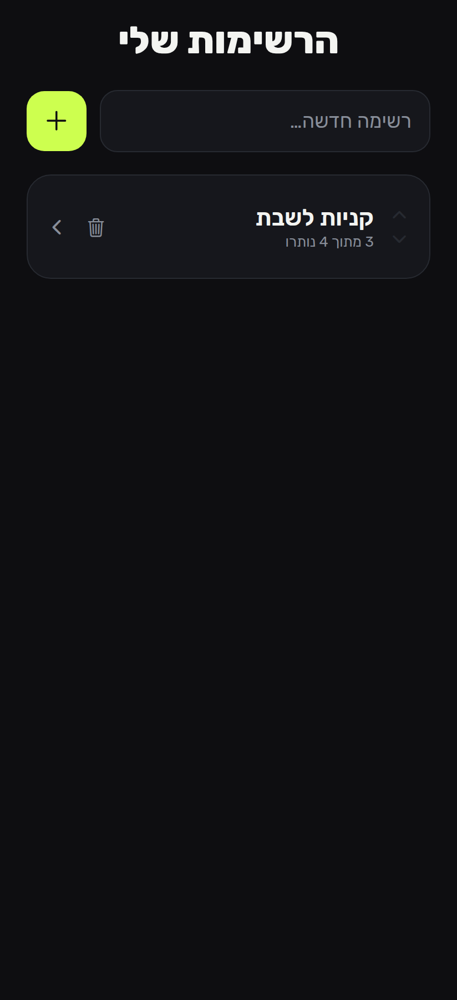
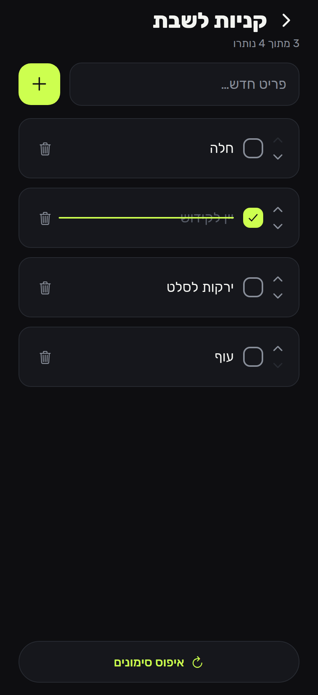

# הרשימות שלי — Checklists

A clean, modern checklist app you can **install on your phone's home screen** (iPhone
+ Android) as a PWA. Create lists, add items, tap to strike them through (without
deleting), reset all strikethroughs, permanently delete, and **reorder lists and
items manually** with up/down arrows. Full **RTL / Hebrew**.

- **Design:** "Ink & Citron" — near-black `#0E0E11` background, glowing lime `#CDFF4F`
  accent, Rubik typeface.
- **Storage:** local-first. Everything is saved on the device (no account, no login,
  works offline). Built with Expo (SDK 56, expo-router) + Reanimated.




## Live app + install to home screen

Hosted via GitHub Pages: **https://orenyaro.github.io/Tetris/**

- **iPhone (Safari):** open the link → tap the **Share** button → **Add to Home
  Screen** → *Add*. Launch it from the new icon; it opens full-screen like an app.
- **Android (Chrome):** open the link → menu **⋮** → **Install app** (or *Add to
  Home screen*).

Because storage is local to the device, data created in the installed app stays on
that device.

## Features

- **Lists:** create, delete, reorder (▲/▼). The home shows all your lists.
- **Items:** add, permanently delete, and tap to mark/unmark — marking draws an
  animated strikethrough and never deletes the item.
- **Reset:** clears every strikethrough in a list while keeping all items.
- **Reorder:** up/down arrows on each list and each item for manual ordering.

## Run / develop locally (optional)

```bash
npm install
npx expo start          # phone via Expo Go, or press "w" for web
```

Rebuild the installable web bundle and the icons:
```bash
npm run build:web       # expo export -p web  (output in dist/)
node scripts/generate-icons.mjs   # regenerate PWA icons into public/
```

## Tests

```bash
npm test
```
Covers the manual-reordering logic (`src/lib/order.ts`): moving items up/down and
the no-op at the list edges.

## Project layout

```
checklist/
├─ src/
│  ├─ app/                 # expo-router screens
│  │  ├─ _layout.tsx       # fonts, forced RTL, dark theme, store boot
│  │  ├─ +html.tsx         # PWA <head>: manifest, Apple meta, service worker
│  │  ├─ index.tsx         # Home (all lists)
│  │  └─ list/[id].tsx     # List detail (items)
│  ├─ components/          # Checkbox, ChecklistItem, ListCard, ReorderArrows
│  ├─ lib/                 # store (local-first), order (reorder), types
│  └─ theme/               # colors, typography
├─ public/                 # manifest.webmanifest, sw.js, app icons
├─ tests/order.test.ts
└─ scripts/                # generate-icons.mjs, screenshot.mjs
```

## Note on multi-device sync

This version is single-device (local-first), which is what makes it install-and-go
with zero setup. Syncing the same list across several phones in real time is a
separate, optional step (a small cloud backend) that can be added later.
